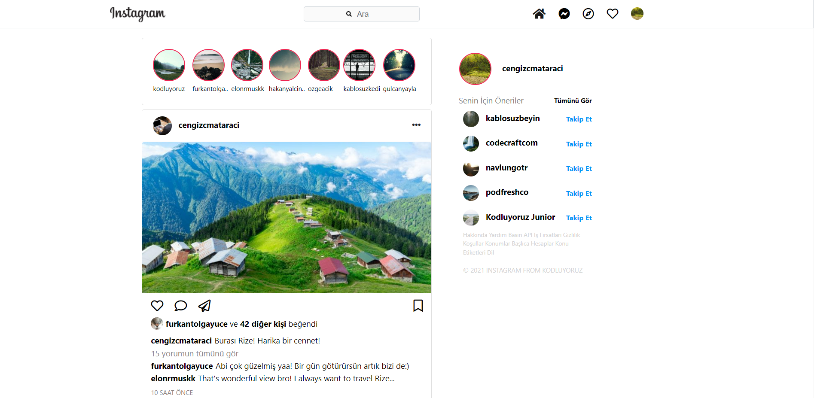

<br/>
<p align="center">
  <a href="https://www.instagram.com/">
    
  </a>
  <h3 align="center">Instagram Clone With Bootstrap
</h3>

</p>

      

## About The Project

This project has been developed to make an interface study. A clone of the main page of Instagram, one of the most popular social media today, has been developed.

## Built With

While developing this project, CSS and Bootstrap features were used in the interface design with which we can make very efficient and rapid developments. Most of the HTML elements in the design are styled with Bootstrap 4, and the necessary icons from the Font Awesome site are also used.

* [Bootstrap](https://getbootstrap.com/)
* [CSS](https://www.w3schools.com/css/default.asp)
* [Font Awesome](https://fontawesome.com/)

## Getting Started

This is an example of how you may give instructions on setting up your project locally.
To get a local copy up and running follow these simple example steps.

### Prerequisites

This is an example of how to list things you need to use the software and how to install them.

* npm

```sh
npm install npm@latest -g
```

### Installation

1. Clone the repo

```sh
git clone https://github.com/FiratCanTas/Instagram-Clone-With-Bootstrap.git
```

. Install NPM packages

```sh
npm install
```

4. Run the project

```JS
npm start
```
